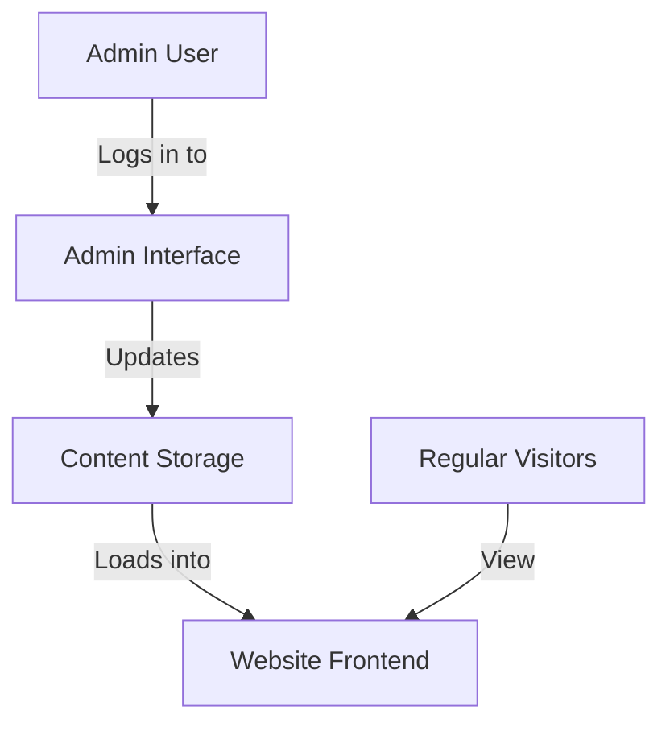
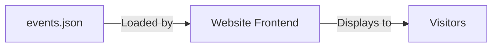
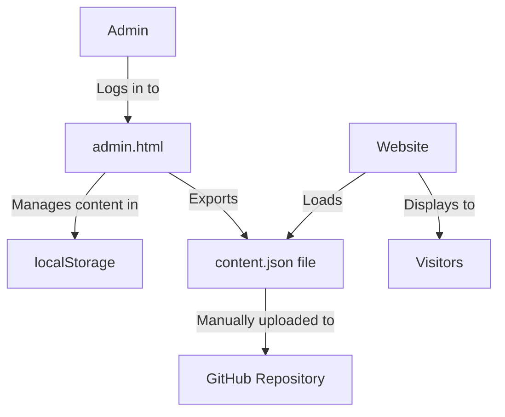
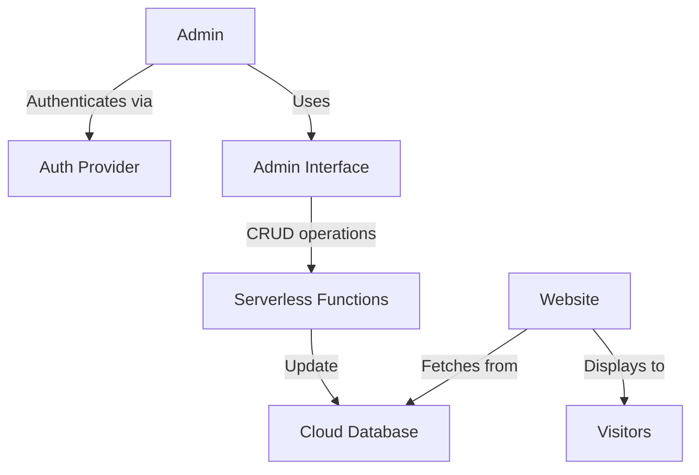

# Admin Interface for Shufukai Kendo Club Website

## Introduction

This document outlines an architectural plan for implementing an admin interface for the Shufukai Kendo Club website. The goal is to enable non-technical administrators to update specific sections of the website (events, schedule changes, announcements) without requiring programming knowledge or developer involvement.

## Current Architecture

The current website is:
- A static HTML site hosted on GitHub Pages
- Contains information about the club, practice details, instructors, and contact info
- Uses JavaScript for functionality like image sliders and mobile menu
- Has no content management system (CMS) or admin interface

## Proposed Admin Interface Architecture

We recommend implementing a "decoupled" architecture where:
1. The website remains primarily static HTML/CSS/JS for optimal performance
2. A simple admin interface is accessible only to authorized users
3. Content is stored in a structured format (JSON)
4. Changes made in the admin interface update the displayed content without modifying the core HTML structure

## Phased Implementation Plan

The implementation is divided into four phases, each building upon the previous one while remaining within context size constraints for Deepseek R1 implementation.

### Phase 1: Content Structure & Storage

**Focus:** Identify updatable content and create storage structure

1. Create a structured JSON file to store dynamic content:
   - Events (title, date, description, image)
   - Schedule changes (effective date, new schedule details)
   - Announcements (title, date, content, importance level)

2. Update the website to load this content:
   - Add a new section for events/announcements on the homepage
   - Modify the practice info section to display schedule from the JSON
   - Add JavaScript to fetch and display content from the JSON file

**Implementation approach:** GitHub-based storage with content in a JSON file in the repository.

**Technical details:**
- Create `/data/content.json` file in your repository
- Add a `loadDynamicContent()` function to your JS that fetches this JSON
- Modify HTML to include placeholder containers for dynamic content
- Update the page on load to display content from JSON

**Context size:** ~10k tokens

### Phase 2: Simple Admin Interface (Local Storage)

**Focus:** Create a basic password-protected admin page

1. Create an admin HTML page (`admin.html`) with:
   - Login form with simple password protection
   - Form interfaces to add/edit/delete events, schedules, and announcements
   - Preview functionality to see changes before publishing

2. Implement client-side storage:
   - Store content in browser's localStorage initially for testing
   - Add export/import functionality to download/upload JSON

**Implementation approach:** Pure frontend solution with local storage for rapid testing.

**Technical details:**
- Create `/admin/index.html` with a simple login form
- Add `/admin/dashboard.html` for content management 
- Implement form handling with JavaScript
- Store draft content in localStorage
- Add export functionality to download content as JSON

**Context size:** ~30k tokens

### Phase 3: Backend Integration (Serverless)

**Focus:** Add true backend storage and authentication

1. Implement secure authentication:
   - Set up auth service (Auth0, Firebase Auth, etc.)
   - Create proper login/logout flow with session management

2. Add serverless API for content management:
   - Create API endpoints for CRUD operations on content
   - Connect admin interface to these endpoints
   - Add validation and error handling

3. Implement automated content publishing:
   - Store content in cloud database (Firebase, Supabase, etc.)
   - Website fetches current content directly from API

**Implementation approach:** Serverless architecture with cloud database and functions.

**Technical details:**
- Set up Firebase/Supabase project 
- Create authentication flow
- Implement serverless functions for content management
- Update both the admin interface and main website to use the API
- Add proper error handling and security measures

**Context size:** ~50k tokens

### Phase 4: Enhanced Admin Experience & Content Types

**Focus:** Improve usability and add more content types

1. Enhance admin interface:
   - Rich text editor for formatted content
   - Image upload and management
   - Role-based permissions (admin vs. content editor)

2. Add more updatable content types:
   - Member achievements
   - Tournament results
   - Photo galleries

3. Implement content scheduling:
   - Schedule future publications
   - Automatic content expiration

**Implementation approach:** Enhance the admin interface and extend the data model.

**Technical details:**
- Integrate rich text editor (TinyMCE, CKEditor, etc.)
- Add image upload capability with cloud storage
- Implement role-based permissions
- Create interfaces for additional content types
- Add content scheduling functionality

**Context size:** ~40k tokens

## Security Considerations

1. **Authentication:** Ensure only authorized users can access the admin interface
2. **Content validation:** Sanitize user input to prevent XSS attacks
3. **API security:** Implement proper CORS policies and request validation
4. **Rate limiting:** Prevent abuse of the content API

## Implementation Guidelines for Deepseek R1

To ensure each phase is implementable with Deepseek R1's context limitations:

1. Break implementation into logical chunks that fit within context limits
2. Focus on one feature at a time (e.g., events management, then schedule updates)
3. Provide clear documentation for each component
4. Use consistent patterns throughout for easier maintenance
5. Use standard libraries and approaches to minimize custom code

## Conclusion

This phased approach allows for incremental development and deployment of an admin interface for the Shufukai Kendo Club website. Each phase provides value on its own while building toward a comprehensive content management solution.

By starting with a simple JSON-based approach and gradually adding more sophisticated features, the club can quickly achieve the ability to update key content without developer involvement, while having a path to more advanced capabilities in the future.